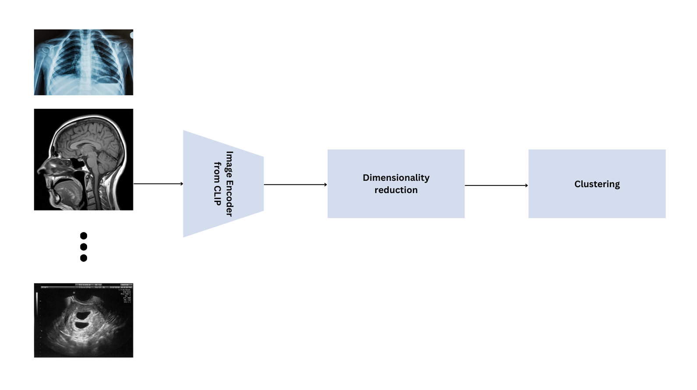
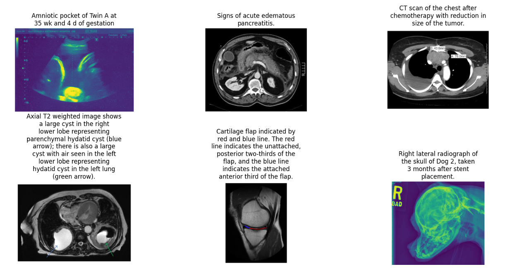
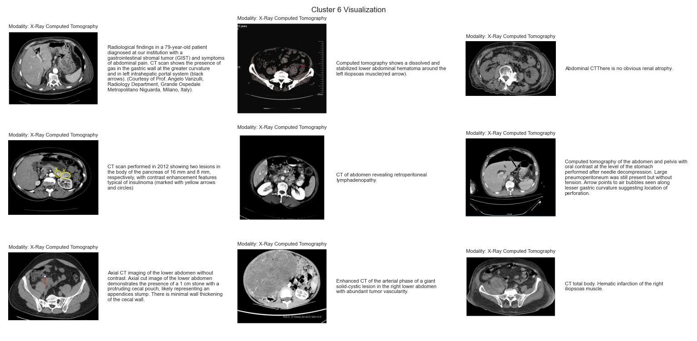
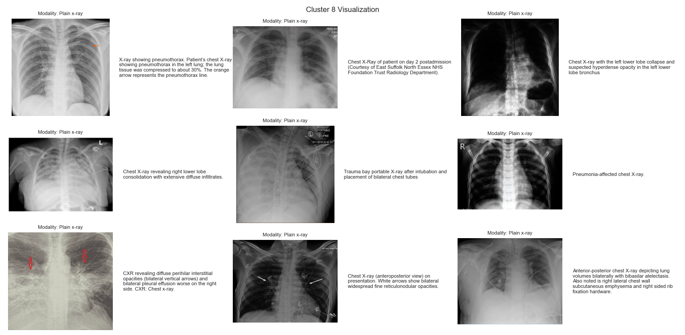

# CLUSTERING WITH CLIP

This repository contains code for clustering of ROCOv2 dataset with and without CLIP encoders. 

Process is shown on this figure:

ROCOv2 random instances are given with the next figure:

## INFERENCE PROCESS:
1) Download test images from a website: https://zenodo.org/records/8333645 (For inference you only need test_images.zip)
2) Place images inside a folder data/ROCOv2/test (All preprocessing for data is already done and placed inside merged_dataset_test.csv)
3) In file config.py setup paths to your local folder for test images and captions
4) From root run inference files that are inside folder inference/ROCOv2 (Without CLIP, with OpenAI CLIP, with trained CLIP - for this you will need a model that need to be placed inside folder model_checkpoints and has an extension .pt - Model can be get by contacting me)
5) Each file will display metrics (Silhouette score, CH index, DB index), visualize clusters in 2D, visualize groups, display KMeans elbow and Silhouette graph

Due to stochasticity of the algorithm there may be slight deviations from the results. Obtained results are:

### WITHOUT CLIP ENCODERS (Only Kmeans with the UMAP reduction):
* Silhouette score: 0.37952467799186707
* Calinski-Harabasz Index: 10405.492642164772
* Davies-Bouldin Index: 0.966343749544095

### WITH OPENAI CLIP ENCODERS (Encoders are used before Kmeans):
* Silhouette score: 0.5876759886741638
* Calinski-Harabasz Index: 51398.360705656865
* Davies-Bouldin Index: 0.5666104711243192

### WITH TRAINED CLIP ENCODERS (Encoders trained on medical dataset are used before Kmeans):
* Silhouette score: 0.6304148435592651
* Calinski-Harabasz Index: 44262.947824014635
* Davies-Bouldin Index: 0.5734992330512745

Group examples obtained with trained CLIP encoders:

References:

[1] https://openai.com/index/clip/ - OpenAI CLIP paper

[2] https://github.com/openai/CLIP - OpenAI CLIP implementation

[3] https://towardsdatascience.com/simple-implementation-of-openai-clip-model-a-tutorial-ace6ff01d9f2 - CLIP model reconstruction, inspiration for our training code